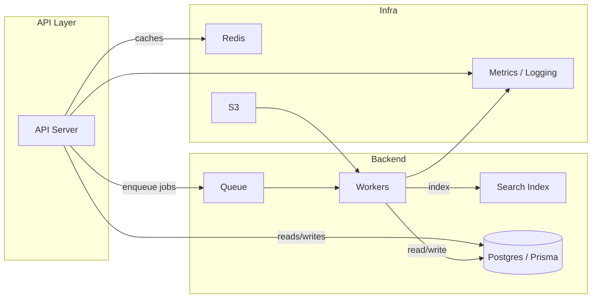
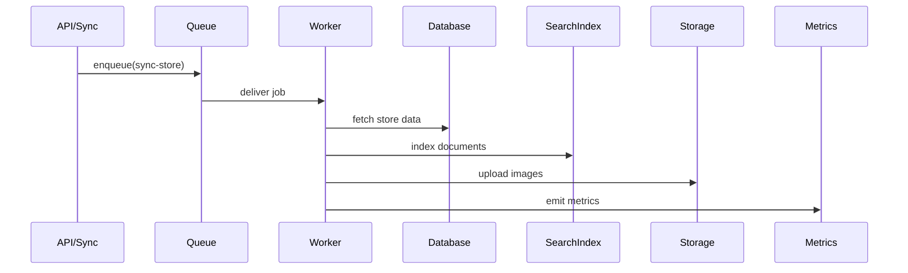
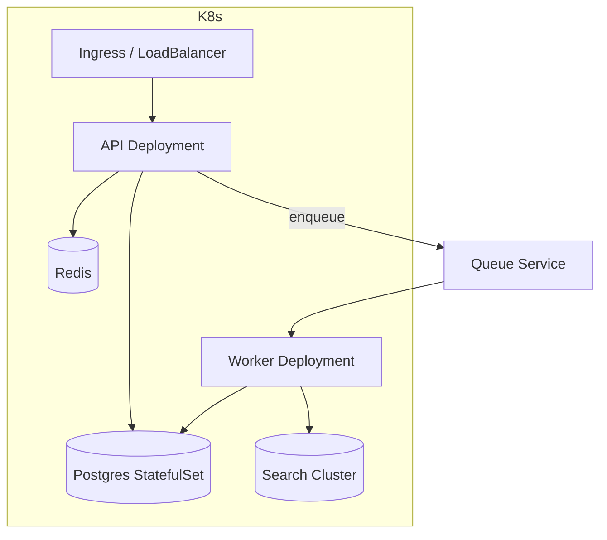

# Архітектура

Огляд архітектури системи, діаграми компонентів та потоки даних.

Розділи:
- Високорівнева діаграма (Mermaid)
- Компоненти та їх відповідальність
- Потоки даних: синхронізація, індексація, API
- Топологія розгортання

Нижче — приклади діаграм у форматі Mermaid та короткі пояснення для кожного компонента.

## Високорівнева діаграма

## Компоненти та відповідальність

- API Server: обробляє HTTP/REST та GraphQL запити, валідацію, аутентифікацію (`apps/backend/src/main.ts`, `auth/`).
- Queue (BullMQ): буферизує довготривалі завдання: синхронізацію магазинів, індексацію, обробку оферт.
- Workers: фонові процеси, що витягують завдання з черги та виконують їх (імпорти, індексація, агрегації).
- Database (Postgres via Prisma): первинне сховище даних — продукти, офери, магазини, історія цін.
- Search Index (OpenSearch / Meilisearch / Elasticsearch): швидкий пошук по SKU, продуктовим метаданим та ранжуванню.
- Cache (Redis): кеш запитів, блокування задач, черги TTL.
- Object Storage (S3): зберігання зображень та великих бінарних артефактів.
- Logging & Metrics: централізовані логи та метрики (Prometheus / Loki / Grafana) для відстеження робочих процесів.

## Потоки даних

### 1) Запит від клієнта (реальний час)

API -> (auth) -> Validate -> DB (read) -> Cache -> Response

- Клієнт робить запит до API.
- API перевіряє аутентифікацію та авторизацію.
- Якщо дані є в кеші — повертає з Redis, інакше читає з DB, віддає і записує кеш.

### 2) Індексація та синхронізація (фонова робота)

- Синхронізація магазинів відбувається через завдання, які ставляться в чергу.
- Робітники виконують парсинг, нормалізацію даних, зберігають у БД та оновлюють індекс пошуку.

## Топологія розгортання

- Docker Compose для локальної розробки: `docker-compose.yml` (Postgres, Redis, search, backend).
- У продакшені рекомендується: Kubernetes + StatefulSets для БД, Deployment для API і Workers, окремий кластер/сервер для Search.
- Міграції Prisma виконуються через CI/CD при релізах; seed-скрипти у `prisma/seed.ts`.

## Діаграма розгортання (спрощено)

## Рекомендації та міркування

- Розділяти API і Workers на різні кодові бази/репліки для незалежного масштабування.
- Використовувати idempotent операції для обробки черги — повторні виконання не повинні ушкоджувати дані.
- Критичні завдання повинні мати retry/backoff та dead-letter логіку.
- Підтримувати схем-версії індексу і мапінги для плавної міграції пошукового індексу.

---

Оновлення: цей файл містить Mermaid-діаграми та пояснення. Щоб відобразити інтерактивні діаграми у статичному HTML, можна згенерувати SVG з Mermaid і вставити його в `docs/architecture.html`.
